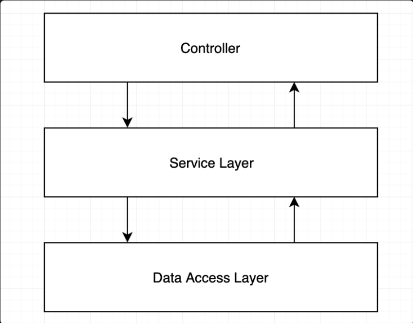

# NestJS REST API example + Swagger documentation

> Tutorial source: [Marius Espejo YouTube channel](https://www.youtube.com/watch?v=2n3xS89TJMI&list=PLlaDAvA2MhR2jb8zavu6I-w1BA878aHcB&index=2)

## About rhe project
The true architecture is implemented.

`NodeJS` architecture [reference](https://dev.to/santypk4/bulletproof-node-js-project-architecture-4epf?signin=true) 
(`dev.to` blog).

### Architecture picture
